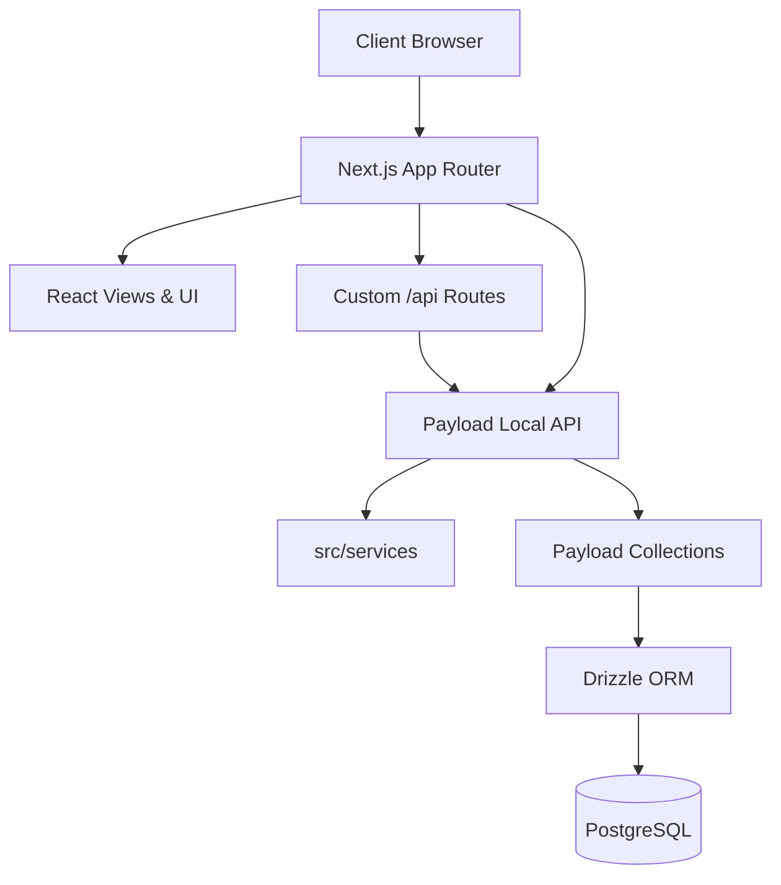

# 01.IDENTITY
- **system_name**: HMS (Hostel Management System)
- **repository**: `/home/midhun/works/hms`
- **purpose**: Complete end-to-end management of hostel properties, bookings, tenancies, maintenance, and student/staff portals.
- **detected_product_scope**: Full-stack monolithic application with an integrated headless CMS (Payload) providing backend capabilities, APIs, and data models, alongside a Next.js App Router for frontend public, student, and staff portals.
- **confidence**: HIGH [V]

# 02.EXECUTIVE_ARCHITECTURE
- **system_summary**: A Next.js monolithic application embedding Payload CMS 3.0. Serves public marketing pages, specialized staff and student portals, and a headless API for custom client interactions.
- **architectural_style**: Monolithic Modular MVC/Resource-driven Architecture. Payload handles the Models/Controllers (Collections/Endpoints), and Next.js React components handle the Views.
- **major_subsystems**:
  - Public Marketing Web (Next.js App Router)
  - Student Portal (Next.js App Router under `/student`)
  - Staff Portal (Next.js App Router under `/staff`)
  - Admin CMS Panel (Payload CMS under `/admin`)
  - Domain Services (TypeScript classes in `src/services`)
  - Data Layer (Payload Collections in `src/collections`)
- **primary_runtime_flow**: Client requests route through Next.js. Data fetching uses Next.js server components interacting directly with the local Payload instance (via `getPayload`), bypassing HTTP for local API requests.

# 03.REPOSITORY_MAP
- **directory_tree**:
  - `/src/app`: Next.js routes (Frontend & API)
  - `/src/collections`: Payload CMS Data Models
  - `/src/components`: Reusable UI Components
  - `/src/services`: Core Business Logic / Domain Services
  - `/src/lib`: Shared Utilities, API Client methods
  - `/src/access`: Security / Access Control Rules
- **applications**: 1 (Monolith)
- **packages**: 0
- **services**: 7 (AuditService, BookingService, CheckInService, CheckOutService, ContractRenewalService, PaymentService, RoomTransferService)
- **important_files**:
  - `payload.config.ts`: Master configuration for collections and database.
  - `next.config.ts`: Next.js specific configuration embedding Payload via `withPayload`.

# 04.TECHNOLOGY_STACK
- **languages**: TypeScript (Primary), CSS
- **frameworks**: Next.js (16.3.2) [V], React (19.2.8) [V]
- **libraries**: Payload CMS (3.88.0) [V], Drizzle ORM (0.45.2) [V], Tailwind CSS (4.3.3) [V], Framer Motion (13.1.1) [V], GraphQL (16.14.2) [V]
- **runtimes**: Node.js
- **infrastructure**: PostgreSQL [V] (via `@payloadcms/db-postgres`)
- **purpose**: Provide a robust, typed backend with rapid CMS setup and modern React capabilities.

# 05.DEPENDENCY_ARCHITECTURE
- **dependency_graph**: Next.js -> Payload -> Drizzle ORM -> PostgreSQL
- **critical_dependencies**: Next.js, Payload CMS, Drizzle ORM
- **internal_dependencies**: `src/app` heavily depends on `src/collections` and `src/services`.
- **conflicts**: None detected.
- **circular_dependencies**: None detected.

# 06.APPLICATION_ARCHITECTURE
- **application_boundaries**:
  - **Marketing**: Public unauthenticated access.
  - **Student**: Requires OTP/Auth, restricted to individual user data.
  - **Staff**: Role-based access control, unrestricted to specific properties.
  - **Admin**: Payload native admin panel, highest privilege.
- **modules**: 
  - Auth, Booking, Portal, UI, Layouts, Marketing.
- **responsibilities**:
  - `collections`: Define schema, validate transitions (hooks), and expose CRUD APIs.
  - `services`: Contain complex multi-entity transactions (e.g., Check-In involves Tenancy, Room, Bed statuses).
  - `app`: Expose UI routes.
- **interactions**: Server actions and API routes interact directly with Payload Local API.

# 07.FRONTEND_ARCHITECTURE
- **routes**:
  - `/` (Hero, Features, Testimonials)
  - `/student/...` (Profile, Room, Payments, Maintenance)
  - `/staff/...` (Properties, Students, Maintenance, Payments, Settings)
  - `/booking/...` (BedSelector, BookingWizard, PaymentSummary)
- **layouts**: `PublicLayout`, `StudentLayout`, `StaffLayout` [D].
- **components**: Categorized by feature module (auth, booking, portal, marketing, ui). Uses CSS Modules (`.module.css`).
- **features**: Wizard-based booking flow, document upload, payment summary.
- **state**: Server-rendered state fetching (App router), localized React state.
- **data_fetching**: React Server Components fetching directly from Payload CMS.
- **UI_system**: Custom UI using Tailwind utility classes + CSS Modules.

# 08.BACKEND_ARCHITECTURE
- **servers**: Embedded Next.js Server (handling both Next and Payload).
- **services**: Domain Logic isolated in `src/services/` (e.g. `CheckInService`).
- **middleware**: Payload access control functions (e.g. `isStaffOfProperty`).
- **business_logic**: Driven by Payload Collection hooks (e.g., `generateTenancyOnApproval.ts`, `validateStateMachine.ts`).
- **background_processing**: Unknown/Unverified [I]. Currently synchronous via API endpoints.

# 09.API_BLUEPRINT
- **endpoints**:
  - REST/GraphQL provided automatically by Payload CMS.
  - Custom REST routes: `/api/students/request-otp`, `/api/students/verify-otp`, `/api/availability`.
  - Custom Collection Endpoints: `/api/tenancies/:id/check-in`, `/api/tenancies/:id/check-out`, `/api/tenancies/:id/room-transfer`.
- **contracts**: Custom endpoints return JSON responses.
- **consumers**: Next.js Client components (`src/lib/api/client.ts`).
- **authentication**: OTP based for students, likely JWT/Cookie based via Payload for staff.
- **validation**: Payload schema validation, explicit API checks.
- **errors**: JSON payload with `error` key and status codes [V].

# 10.DATA_BLUEPRINT
- **database**: PostgreSQL (via `@payloadcms/db-postgres`).
- **schemas**: 34 Core schemas defined in `src/collections/`.
- **models**: Hierarchy: Properties -> Buildings -> Floors -> Rooms -> Beds.
  - Operational models: Bookings, Tenancies, Payments, Invoices, MaintenanceRequests.
- **relationships**: Highly relational (e.g. Booking links Person, Property, Building, Floor, Room, Bed).
- **migrations**: Handled dynamically by Payload/Drizzle integration.
- **persistence_flows**: UI -> Next.js API/Action -> Payload Local API -> PostgreSQL.

# 11.STATE_BLUEPRINT
- **state_sources**: Database (Single source of truth).
- **stores**: No global frontend state store (Redux/Zustand) detected [I]. Relies on Server Components and route/query state.
- **transitions**: State machines strictly enforced on backend via Hooks (e.g. Booking `status` DRAFT -> APPROVED).
- **synchronization**: Standard HTTP request/response cycle.

# 12.AUTH_SECURITY_BLUEPRINT
- **identity**: Managed by Payload's native auth (Users collection), customized for Students via OTP (`request-otp`/`verify-otp`).
- **sessions**: Payload Auth Sessions.
- **roles**: Differentiated by collection (`isStaffOfProperty`, `isAdminOrSelf`).
- **permissions**: Handled in Payload Collection `access` definitions.
- **trust_boundaries**: Next.js API Routes and Payload Access functions.
- **security_observations**: OTP mock implementation in `/api/students/request-otp` needs real integration for production [V].

# 13.INTEGRATION_BLUEPRINT
- **external_systems**: `IntegrationLogs` collection suggests external hooks, but specific APIs (e.g., Payment Gateway, SMS) are not explicitly integrated in the traced files [I].
- **SDKs**: None detected directly (Stripe/Twilio expected but missing in basic trace).
- **data_exchange**: Standard JSON.

# 14.CONFIGURATION_BLUEPRINT
- **environment**: Defined via `.env`, `.env.local` [V].
- **runtime_config**: `next.config.ts`, `payload.config.ts`.
- **build_config**: `tsconfig.json`, `eslint.config.mjs`, `postcss.config.mjs`.
- **feature_flags**: Unknown [I].

# 15.USER_AND_SYSTEM_FLOWS
- **primary_user_flows**:
  - Student: Request OTP -> Verify OTP -> Portal Dashboard -> View Invoices/Maintenance.
  - Booking: Select Hostel -> Select Bed -> Fill Details -> Upload Docs -> Pay -> Approved.
- **request_flows**: User -> Next.js route -> Server action / API Route -> Payload CMS -> Database.
- **failure_flows**: Graceful error catching in APIs returning `{ error: "..." }`.

# 16.TEST_QA_BLUEPRINT
- **test_structure**: `jest`, `supertest` configured [V]. Tests located in `src/tests/` (e.g., `hms-invariants.spec.ts`).
- **critical_paths**: State invariants (tested in `hms-invariants.spec.ts`).
- **coverage_signals**: Unknown test coverage metrics [I].

# 17.DEPLOYMENT_BLUEPRINT
- **build**: standard `next build` command.
- **CI_CD**: Unknown [I]. No `.github` or similar folders detected.
- **hosting**: Configured for standard Node.js server (Vercel or Docker-based Node environment) given Next.js usage.
- **runtime**: Node 20+ (based on `@types/node: ^20`).
- **environments**: Handled via `.env` files.

# 18.OBSERVABILITY_BLUEPRINT
- **logging**: Domain logs stored in DB Collections (`AccessLogs`, `SystemAuditLogs`, `NotificationLogs`, `IntegrationLogs`).
- **metrics**: Unknown [I].
- **tracing**: Handled internally via Audit logs hooks (`immutableLog.ts`, `auditBookingTransitions.ts`).

# 19.ARCHITECTURAL_PATTERNS
- **detected_patterns**: Headless CMS, Repository Pattern (via Payload API), Service Layer Pattern (`src/services`).
- **evidence**: `BookingService.ts`, `CheckInService.ts` [V].
- **usage**: Offloading complex logic from Collection Hooks into dedicated Domain Services.

# 20.ARCHITECTURAL_ANTI_PATTERNS
- **detected_signals**: Logic split between Hooks and Services.
- **evidence**: `generateTenancyOnApproval.ts` vs `CheckInService.ts`.
- **impact**: Low right now, but could lead to disjointed business logic if not standardized.

# 21.TECHNICAL_DEBT
- **evidence_based_only**: Python scripts found at root (`fix_logic.py`, `update_properties.py`, etc.) imply ad-hoc data/migration fixes outside the standard ecosystem.
- **severity**: Low.
- **consequence**: Messy root directory, untracked formal migrations.
- **suggested_direction**: Move scripts to `src/scripts` and formalize migrations.

# 22.ARCHITECTURAL_RISKS
- **risk**: OTP logic is mocked/incomplete.
- **evidence**: `/api/students/request-otp/route.ts` comment [V].
- **mitigation_direction**: Implement actual SMS/Email gateway.

# 23.GAPS_AND_UNKNOWNS
- **missing_information**: Actual Payment Gateway implementation.
- **undocumented_systems**: Deployment targets.

# 24.DOCUMENTATION_DRIFT
- **documented_claim**: None validated yet against a standard architecture doc. README is present but contents were not deep scanned.

# 25.ARCHITECTURE_DECISIONS
- **observed_decisions**: Using Payload as embedded backend inside Next.js App router.
- **evidence**: `next.config.ts` uses `withPayload` [V].
- **consequences**: Simplifies deployment to a single Node.js instance, restricts independent scaling of CMS vs Frontend.

# 26.EXTENSION_POINTS
- **plugin_points**: Payload Plugins, React component system.
- **APIs**: Exposes Native GraphQL and REST via Payload natively.

# 27.CURRENT_SYSTEM_TOPOLOGY

# 28.FILE_INDEX
- `payload.config.ts`: Central Payload configuration, schema registration.
- `next.config.ts`: Next.js config with Payload HOC.
- `src/services/CheckInService.ts`: Check-in domain logic.
- `src/collections/Bookings/index.ts`: Booking data model and state hooks.

# 29.EVIDENCE_REGISTER
- **claim**: Monolithic Next.js+Payload app.
- **evidence**: `package.json` dependencies and `payload.config.ts` [V].
- **claim**: Domain Services handle complex logic.
- **evidence**: `src/collections/Tenancies/index.ts` delegates to `CheckInService.execute` [V].

# 30.REVERSE_ENGINEERING_SUMMARY
- **what_is_known**: Core data model, routing layout, technology stack, integration patterns.
- **what_is_derived**: Frontend layout component usage, absence of global state store.
- **what_is_unknown**: CI/CD pipelines, production deployment environment, payment gateway specifics.
- **highest_priority_verification_items**: Review `README.md` for undocumented infrastructure details, check payment gateway implementation in API.
